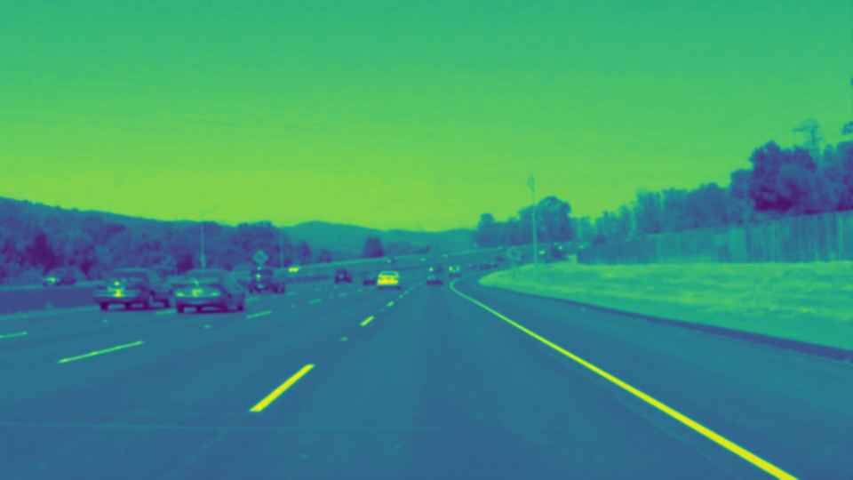
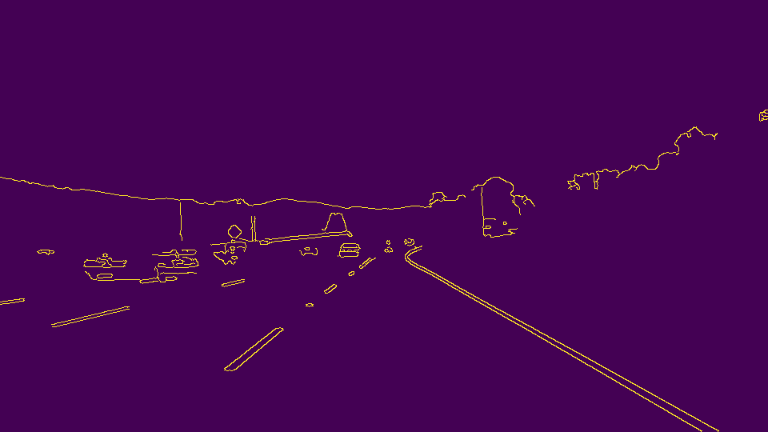
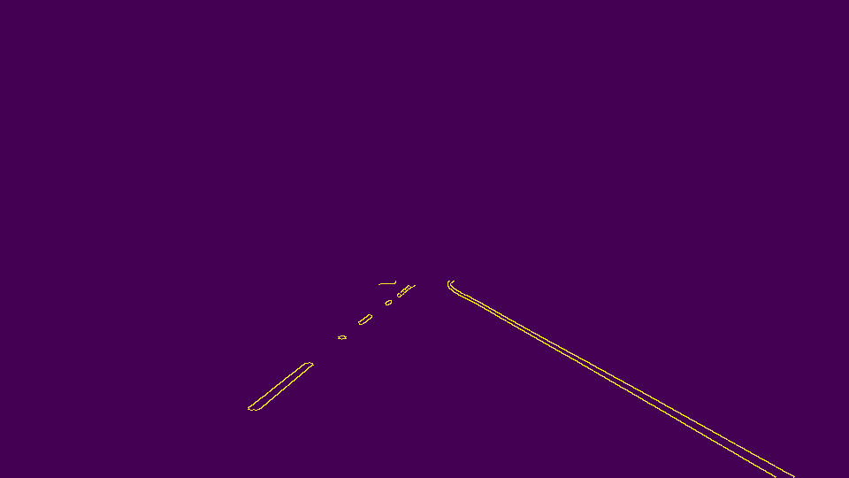
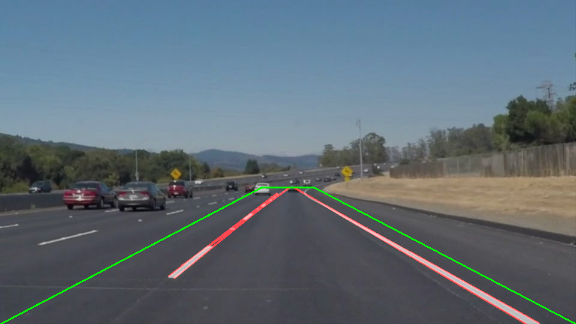

# **Project: Lane Lines Detection**#

Overview
---

The purpose of this project is to create a pipeline which when given video (or images) of a road being traversed will accurately be able to detect the left and right lane markings. In theory this should allow a center line to be virtually established, which when paired with a control system would enable a vehicle to cruise steadily down a road with no driver input. While far from fully autonomous capabilities, this feature would provide an advanced cruise control of sorts only needing a high quality camera. The project in its current iteration only uses OpenCV tools for image processing - leaving a breadth of edge cases still unresolved. This will be addressed in future iterations of this project!

1. Describe the pipeline

2. Identify any shortcomings

3. Suggest possible improvements

The Project: A straightforward Pipeline
---

**Step 1:** Preprocessing the video/image: Reading the image in grayscale and applying a gaussian blur. This should make it easier to detect edges (we are not checking for color yet) and should hopefully filter out any noise which could lead to some false positive lane detection.

**Step 2:** Canny Edge detection: Find the gradient of the image and use a user defined range to select which range of color changes to keep. (This step is important before applying a boundary filter since some lane marking will partially extend out of the soon to be defined area of interest)

**Step 3:** Apply a mask: Not all edges are relevant - and even some relevant edges are unnecessary. We're particularly interested in the triangular / trapezoidal area in front of a vehicle, so we can mask out the rest. 

**Step 4:** Lane Line Detection: This is the heavy lifting step - how do we distinguish between edges that are lane lines and others? Thankfully on roads and within the area (triangular-ish) we've focused on the lane markings are the strongest source of edges in our image (normally - sometimes road conditions change, cars or other objects could dominate the edges found along lane markings.) We approach this be setting criteria for our lane markings. We want to group the lines defined by edges so some x number of lines forming a larger line of length at least y with at most z sized gaps in between count as a lane marking. The values for these variables can take some time to get right. We use Hough transform to conveniently describe the lines we've found in some point space - transforming our problem from grouping lines to grouping points.

**Step 4.5:** Extrapolate lane lines: Lane lines don't always start at the bottom of the captured video/images and end at the top of the desired section - yet these gaps don't mean the lane boundaries shouldn't extend to these areas. We can extend the found boundary lanes so the span the length of our desired image.

**Step 5:** Additional filters: We can apply some additional filters to narrow down on false positive cases - such as nearby vehicles, barriers, shadows producing strong color contrasts on camera. One way to do this is to filter by "lane" angle - we expect our lane markings to be closer to vertical than horizontal. This fairly simple change can get rid of a lot of false positive from road conditions. Finding the average slope of detected lines (sorted into left and right) will also get rid of some false positives emanating from other sources - however there's still many false negative cases encountered which need more looking at. 

